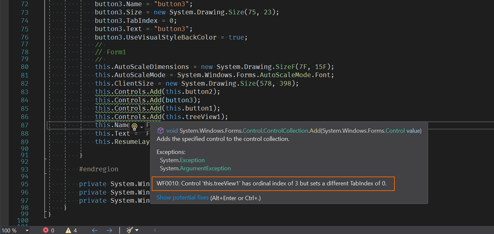

A proof of concept for Windows Forms Roslyn analyzers

---

`ControlTabOrderAnalyzer` checks and warns if the programmatic tab order of UI controls on a form or a usercontrol is different from the natural tab order.

Related reading:
* "_Order of elements in the UIA tree_" section in [Considerations around the accessibility of a WinForms Store app](https://docs.microsoft.com/en-us/archive/blogs/winuiautomation/considerations-around-the-accessibility-of-a-winforms-store-app)
* "_Order, Order! The keyboard and programmatic order of your controls will make or break the experience for your customers_" section in [Real-world learnings on keyboard accessibility in WinForms and WPF apps](https://www.linkedin.com/pulse/real-world-learnings-keyboard-accessibility-winforms-wpf-guy-barker)